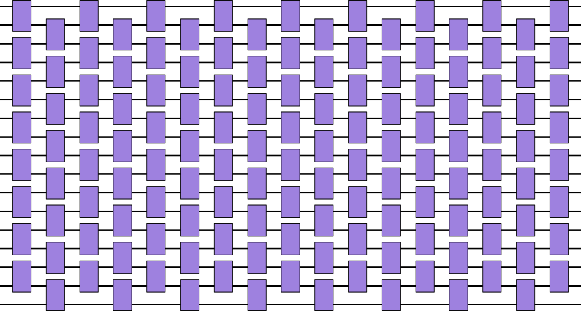

# Research Experiments using Cirq

In addition to software for building and testing circuits (Cirq),
we have a library of research experiments using Cirq -- [ReCirq](https://github.com/quantumlib/ReCirq)!

This repository contains code for our flagship experiments, enabling
you to reproduce and extend cutting edge quantum computing research.

## Audience

If you are a quantum researcher looking to develop world class NISQ experiments,
this library can provide you the template for your future experiments.
Experiments such as QAOA and HFVQE provide a template for performing variational
algorithms demonstrating the iteration between data collection and circuit 
parameter adjustment. Other experiments such as the Fermi-Hubbard experiment 
can be used as a template for exploring dynamics of condensed matter physics
with sophisticated calibration techniques.

If you are learning quantum computing, we also encourage you to try out the
tutorials and familiarize yourself with the experiments. While these
experiments are more complicated than some example introductory algorithms
found in a quantum computing textbook, if you put in the effort to understand
them you will be on the cutting edge of experimental quantum computing!
The code documented here was used to produce high impact publications. 

## How to use this code

There are many ways you can use ReCirq. One path is as follows: 

 1. Pick an experiment that closest match your interest
 2. Read the paper
      - Pay careful attention to the error mitigation and calibration
        techniques used in the experiment to maximize performance
 3. Go through the tutorial of each experiment. It will give you an overview 
    of how the experiment actually works. Try out the tutorial either on your
    simulators or actual quantum computers.
      - Pay attention to the dependencies of the experiments. This includes
        Cirq, libraries like OpenFermion, and qsim.
 4. Read the guide to learn about best practices for building up your own experiment
 5. Go build your own experiment. If it is cutting edge, please contribute
    back to ReCirq!

## Contributing to ReCirq

We hope ReCirq will become the go-to repository for cutting edge NISQ
experiments. By contributing experiments or modifications to ReCirq, your
research will be exposed to quantum researchers around the world to reproduce
and extend your results. Contributed documentation and tutorials will be used
by teachers in quantum information science to train the next
generation of students.

