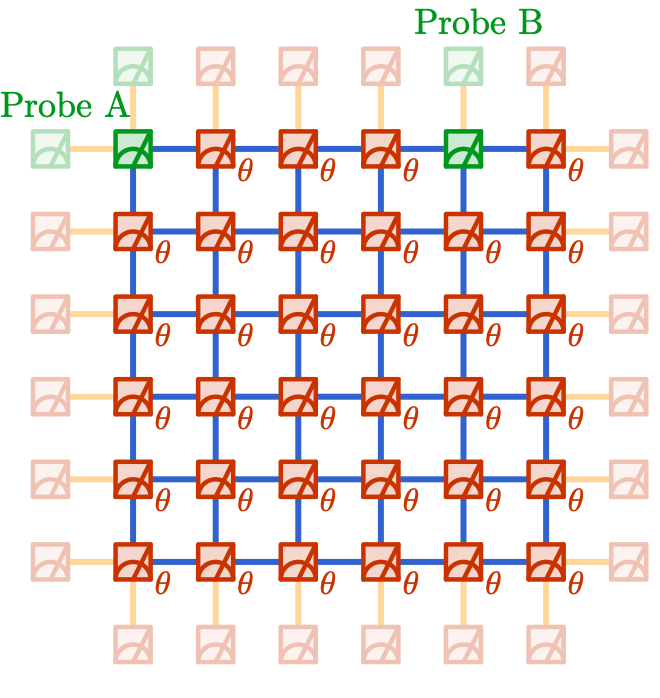

# Cluster State Circuit Construction

This module provides tools for constructing cluster state circuits using Google's Cirq framework.

## Circuit Construction

The module implements a 6x6 grid of qubits with ancilla qubits for error mitigation. The circuit construction process involves:

1. **Grid Setup**: 
   - Creates a 6x6 grid of physical qubits
   - Adds ancilla qubits for error mitigation
   - Positions probe qubits at specific distances (3-6 units apart)

2. **Circuit Generation**:
   - Applies Hadamard gates to all qubits
   - Applies CZ gates to create cluster state
   - Implements single-qubit rotations (Rz and Ry gates)
   - Adds basis rotations for measurement in X, Y, or Z basis
   - Includes ancilla qubit operations for error mitigation
   - Measures all preparation qubits to create entanglement pairs for probe qubits

### Implementation Details

The circuit is constructed on a 6x6 grid of qubits. Let $L$ be the system linear dimension and initialize all qubits in the product state $|0\rangle^{\otimes N}$. The protocol proceeds as follows:

1. **Apply Hadamard gates:** $\bigotimes_j H_j$
2. **Apply nearest-neighbor $ZZ$ gates for $t = \pi/4$:**
   $e^{i(\pi/4)\sum_{\langle j,k \rangle} Z_j Z_k}$
3. **Apply single-qubit rotations:** $\bigotimes_j e^{i(\theta/2) Y_j} e^{i(\phi/2) Z_j}$

After these steps, projective measurement in the $Z$ basis is performed on the preparation qubits (solid red in the figure below) to prepare the probe qubits' states (solid green). Shadow measurements are then performed on the probe qubits using the $X$, $Y$, and $Z$ bases with equal probability to collect data.

The nearest-neighbor gate $e^{i(\pi/4)\sum_{\langle j,k \rangle} Z_j Z_k}$ is implemented by first applying a controlled-$Z$ ($\mathrm{CZ}$) gate between each pair of qubits, followed by local $Z^{-1/2}$ on both qubits, i.e., $\mathrm{CZ}_{jk}Z_j^{-1/2}Z_k^{-1/2}$. All nearest-neighbor two-qubit gates are applied in the following sequence to maintain constant circuit depth as the system size scales up: first, odd horizontal links; then, even horizontal links; followed by odd vertical links and finally even vertical links.



*Figure: Experimental realization of the circuit on a quantum chip with $6\times6$ lattice at $d=5$. Solid red: preparation qubits; solid green: probe qubits A and B. Faded qubits are ancillaries for readout error mitigation.*

#### Error Mitigation

Since the dominant source of error in this experiment is readout error, a replication-based error mitigation strategy is employed. After all gates (including basis rotations on probe qubits for shadow measurement), an additional CNOT gate is inserted from each perimeter qubit to its corresponding ancillary qubit (represented as faded boxes in the figure above, indicated by yellow bonds). This operation replicates the measurement outcome of the physical qubit onto the ancillary qubit. In post-processing, only measurement outcomes with matching values on each physical-ancillary pair are retained (post-selection), further enhancing the reliability of the experimental results on the mitigated qubits.

## Usage

To use the module:

```python
from recirq.Cluster_state_MIPT import get_circuit, get_two_qubits_6x6

# Create a 6x6 grid with probe qubits at distance 6
qubits_matrix, probe_qubits, anc_pairs, all_qubits = get_two_qubits_6x6(d=6)

# Generate a circuit with X-basis measurements
circuit = get_circuit(
    qubits_matrix=qubits_matrix,
    theta=0.0,
    phi=0.0,
    probe_qubits=probe_qubits,
    basis=[0, 0],  # X basis
    anc_pairs=anc_pairs
)
```

## Dependencies

- Cirq >= 0.13.0
- NumPy >= 1.19.0
